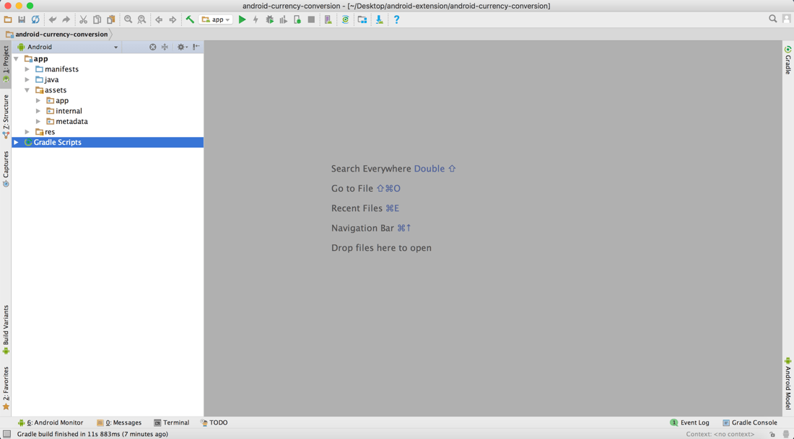

# Extend your existing Android app with NativeScript

> **WARNING**: Embedding NativeScript into an existing Android application is an experimental feature. If you’re interested in seeing this scenario being officially supported, please [let us know on GitHub](https://github.com/NativeScript/android-runtime/issues/321).

This article will walk you through setting up an already existing Android Studio project to integrate with the NativeScript runtime, and execute NativeScript code.

## Requirements: 
 - Android Studio 3.1+
 - NativeScript CLI 4.0+
    - Nativescript Android platform 4.0+

## Extending the native application

1. Create or open the NativeScript application that will serve as an extension to the original Android app:

    NativeScript with Angular:
    `tns create ns-stock-ticker --ng`

    NativeScript with TypeScript:
    `tns create ns-stock-ticker --tsc`

    NativeScript with plain JavaScript:
    `tns create ns-stock-ticker`

2. Implement the necessary functionality in NativeScript using your preferable language, style, or technology. 

    Build your NativeScript application for Android. Everything necessary to integrate with the existing Android app will be output inside `platforms/android`

    ```shell
    cd ns-stock-ticker
    tns build android
    ```

3. Copy the NativeScript assets dir into the Android Studio project main dir:
    **ns-stock-ticker/platforms/android/app/src/main/assets** -> **android-project/app/src/main**

    

4. Copy the NativeScript Java files into the Android Studio project:
    **ns-stock-ticker/platforms/android/app/src/main/java** -> **android-project/app/src/main/java**

5. Copy the NativeScript android runtime **aar** into the Android Studio project:
    **ns-stock-ticker/platforms/android/app/libs/runtime-libs/nativescript-optimized-with-inspector.aar** -> **android-project/app/lib**
    
6. Copy the NativeScript core modules widgets **aar** into the Android Studio project:
    **ns-stock-ticker/node_modules/tns-core-modules-widgets/platforms/android/runtime-libs/widgets-release.aar** -> **android-project/app/lib**

7. Reference the runtime and widgets libraries in the Android Studio project:

    Open **Gradle Scripts/build.gradle** for the **app** module and add the following:

    ```groovy
        dependencies {
            ...
            implementation fileTree(dir: 'libs', include: ['*.aar'])
            implementation "com.android.support:multidex:1.0.2"
            ...
        }
    ```

8. Add both [Java classes](https://github.com/NativeScript/sample-extend-android-app/tree/master/common/main/java/org/nativescript/currencyconversion) and [JavaScript implementations](https://github.com/NativeScript/sample-extend-android-app/tree/master/common/main/assets/app) of **MyCustomNativeScriptActivity** and **MyCustomNativeScriptFragment** to your Android app:
    
    Java files - Make sure they match the proper package folder structure. Also make sure to match the package at the top of the two Java files to that of your actual package.

    JavaScript files - Make sure that the Android Activity referenced in JavaProxy is changed to match that of your actual project. It is located at the bottom of the **MyCustomNativeScriptActivity.js** and **MyCustomNativeScriptFragment.js** files.

9. Register the new activity in the AndroidManifest:

    Like with any Android Activity, it needs to be added to the AndroidManifest.xml file. The AndroidManifest.xml file should include the following line:
    ```xml
    <activity android:name=".MyCustomNativeScriptActivity" />
    ```
    
10. Register com.tns.ErrorReportActivity in the AndroidManifest:

    It is used for showing any NativeScript errors during runtime. The AndroidManifest.xml file should include the following line:
    ```xml
    <activity android:name="com.tns.ErrorReportActivity" />
    ```

11. Initialize the NativeScript Android runtime:

    Anywhere in your Activity place the following snippet:
    ```Java
    private com.tns.Runtime nsRuntime;

    public void openNativeScriptActivity() {
        if (nsRuntime == null) {
            nsRuntime = com.tns.RuntimeHelper.initRuntime(MainActivity.this.getApplication());
            if (nsRuntime != null) {

                nsRuntime.run();
            } else {
                return;
            }
        }

        android.content.Intent intent = new android.content.Intent(MainActivity.this, MyCustomNativeScriptActivity.class);
        intent.setAction(android.content.Intent.ACTION_DEFAULT);
        startActivity(intent);
    }
    ```

12. Play the app:

    Finally call `openNativeScriptActivity` to fire up the NS Android Runtime.

---

## **Sample app code:** 
[NativeScript](https://github.com/NativeScript/)/[sample-extend-android-app](https://github.com/NativeScript/sample-extend-android-app)

## **Additional Notes:**
 - Arbitrary JavaScript files can be executed using the `Runtime.runScript()` method like so:
    - ```Java
      nsRuntimeInstance.runScript(new File(context.getFilesDir(),"app/view.js"))
      ```

## **Known Limitations**:
 - JavaScript metadata for all available Android classes is prebuilt and cannot be generated from within the Android Studio project. Rebuild the NativeScript project with the respective Android plugins if their classes are going to be consumed from within JavaScript/TypeScript/Angular.
 
## **Credits:** 
Original *CurrencyConversion* Android application and step-by-step tutorial courtesy of [The Polyglot Developer](https://www.thepolyglotdeveloper.com/2017/06/legacy-android-java-nativescript-angular/).
