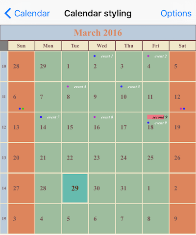
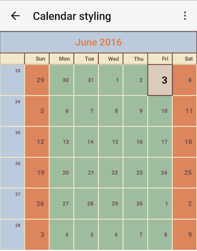

# Calendar Month View Styling

The Month view mode has the most complicated styling since there are many different types of cells that are used to represent different information to the user.
In order to apply custom style for this mode, you need to initialize the `monthViewStyle` property of `RadCalendar` with instance of `CalendarMonthViewStyle`.
The following image shows the different UI elements that are customizable in this view mode:

There are some properties that change the month view :

- `backgroundColor` - a color that is applied as background color
- `showTitle` - determines if title should be shown
- `showWeekNumbers` - determines if week numbers should be shown
- `showDayNames` - determines if day names should be shown
-  - defines the decoration shape drawn in the center of a selected cell within the month view. Accepts values from the  module
-  - defines the size of the decoration shape drawn in the center of a selected cell within the month view. In case the shape is  the property determines the side of the square draw. If the shape is  the size determines the radius of the circle drawn
-  - determines the color of the selection shape

In order to style any type of the available cell in calendar you need to initialize the corresponding style property of `CalendarMonthViewStyle` class, that is used for this view mode:

- `dayCellStyle` -  defines styling of cells that represent a regular day in month/week. This is the default style that will be applied if the date is not special
- `selectedDayCellStyle` -  defines styling of selected cells
- `todayCellStyle` -  defines styling of the cell that shows the today date
- `dayNameCellStyle` -  defines styling of cells with names of days
- `weekNumberCellStyle` - defines styling of cells with number of weeks
- `weekendCellStyle` - defines styling of cells that visualize days of the weekends
- `titleCellStyle` - defines styling for the calendar title with month name

There are two classes you should use to initialize these properties:  `CalendarCellStyle` and its inheritor `CalendarDayCellStyle`.
Properties `weekNumberCellStyle`, `dayNameCellStyle` and `titleCellStyle` should be initialized with `CalendarCellStyle` instance.
Properties `dayCellStyle`, `todayCellStyle`, `selectedDayStyle` and `weekendCellStyle` should be initialized with `CalendarDayCellStyle`.

The `CalendarCellStyle` class has properties for common styling options of any of the cells:

- `cellBorderWidth` -  defines the border width of the cell
- `cellBorderColor` -  defines the border color of the cell
- `cellBackgroundColor` -  defines the background color of the cell
- `cellAlignment` -  defines the content alignment in the cell
- `cellTextColor` -  defines the color for the text shown in the cell
- `cellTextFontName` -  defines the name of the font you want to use.
- `cellTextFontStyle` -  defines the style of the font used for text in cell.
- `cellTextSize` -  defines the text size in cell
- `cellPaddingHorizontal` -  defines the amount of horizontal padding
- `cellPaddingVertical` -  defines the amount of vertical padding  

The `CalendarDayCellStyle` extends this set with some style properties specific to the date cells like:

- `showEventsText` -  defines if the events should be visualized with text and shape or with shape only
- `eventTextColor` -  defines the color for the text of events shown in the date cell
- `eventFontName` -  defines the name of the font you want to use for events text in date cell.
- `eventFontStyle` -  defines the style of the font used for events text in date cell.
- `eventTextSize` - defines the size of the events text in date cell

## Example

To better illustrate the usage of styling properties, we will use a simple scenario in which the cells are customized:

<snippet id='calendar-monthview-styling'/>

This is how the calendar looks like:

      

## References
Want to see this scenario in action?
Check our SDK examples repo on GitHub. You will find this and many other practical examples with NativeScript UI.

* [Styling Example](https://github.com/telerik/nativescript-ui-samples/tree/master/calendar/app/calendar/cell-styling)

Related articles you might find useful:

* [**Styling Inline Events**]()
* [**Styling Year View**]()
* [**Styling Week View**]()
* [**Styling Month Name**]()
