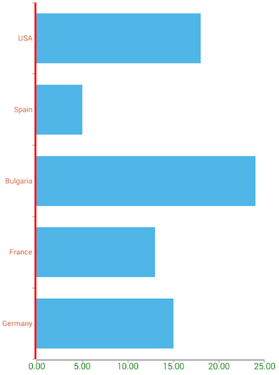
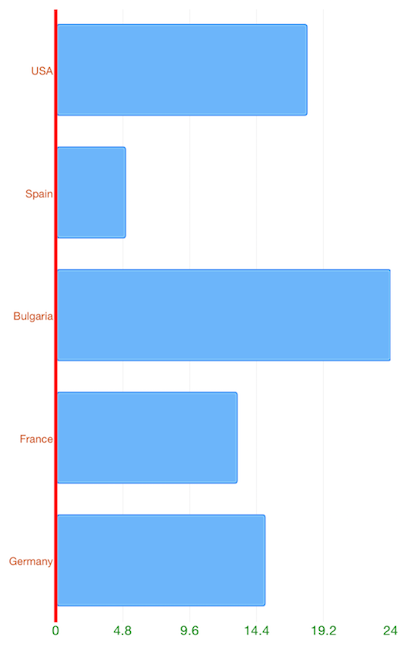

### Styling: Axes
Styling the chart axes is done by using the corresponding customization properties exposed by the axes. All axes used in Telerik Chart for NativeScript define the following properties:

-  - defines the color of the axis' line
-  - defines the thickness of the axis' line
-  - defines if the axis line is hidden. 
-  - defines the color of the axis' labels
-  - defines the text size of the axis' labels
-  - defines the format used to display the axis' labels
-  - defines the margin for the labels
-  - defines the angle of rotation for labels. Requires *Rotate* value for *labelFitMode* property
-  - defines the fit mode for labels. By default labels are positioned on single line but there are  and  options too.
-  - defines the layout mode for axis labels. With this property you can position labels in the  or  side of chart.

For the properties not specified exclusively the default values from the chart palette are used.

#### Example

To better illustrate the usage of Axis properties, we will use a simple scenario in which the Axes are customized:

<snippet id='axis-styling'/>

This is how the chart looks like now:
 

## References
Want to see this scenario in action?
Check our SDK examples repo on GitHub. You will find this and many other practical examples with NativeScript UI.

* [Customization Example](https://github.com/telerik/nativescript-ui-samples/tree/master/chart/app/examples/axes/customization)

Related articles you might find useful:

* [**Linear Axis**]()
* [**Logarithmic Axis**]()
* [**DateTime Continuous Axis**]()
* [**Categorical Axis**]()
* [**DateTime Categorical Axis**]()
* [**Negative Values Axis**]()