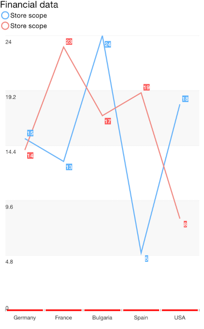
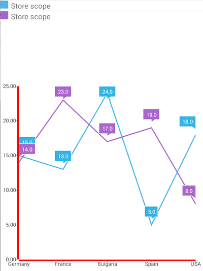

### Styling point labels
In order to show series default labels you should set the  property of each series to true. By default its value is false. If you want to style the point labels that are shown for series values you can initialize the  property of the series with instance of .
Supported properties are: 
- : the point label background fill color 
- : the color of the label stroke
- : the margin of label
- : the string used as a formating string for label value. This format must comply to [IEEE printf Specification](http://pubs.opengroup.org/onlinepubs/009695399/functions/printf.html)
- : the label font color
- : the size of label font 
- : the font name. If it is missing from the OS the default font is used instead.
- : specify the style of font. *Bold* , *Italic* , *BoldItalic* and *Normal* values can be used. Defaults to *Normal*

#### Example

To better illustrate styling of point label let's look at the following example:

<snippet id='labels-styling'/>

This is how the chart looks like now:

iOS:

Android:

### Axes Labels

All axes have their default labels. They are visible by default. In order to display or hide them, you simply need to use the **showLabels** property of the axis. If you want to learn more about styling axis labels please visit [Axis Styling] ( "Learn more about styling axes")

## References
Want to see this scenario in action?
Check our SDK examples repo on GitHub. You will find this and many other practical examples with NativeScript UI.

* [Styling Examples](https://github.com/telerik/nativescript-ui-samples/tree/master/chart/app/examples/styling)