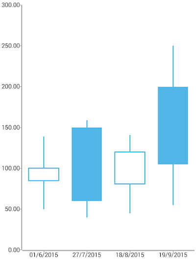
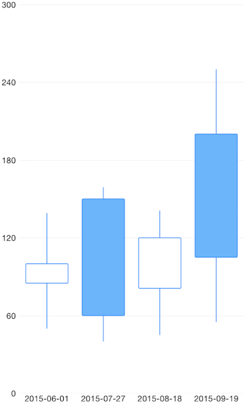

# CandleStick series: overview
 This series operates with a special kind of data in the form of four parameters defining the stock market - open, high, low, and close. The high and low values show the price range (the highest and lowest prices) over one unit of time. The open and close values indicate the opening and closing price of the stock for the corresponding period. Candlestick series have body, which has a different color depending on the value of open and close prices of the financial data point. The width of the candlestick body is determined by the period between 2 candlesticks and the range of the axis. You should use the  property of  to change the period between 2 candlesticks. Here is how to set up Candlestick series:

## Customization

Candlestick series have body, which has a different color depending on the value of open and close prices of the financial data point. The width of the candlestick body is determined by the period between 2 candlesticks and the range of the axis. You should use the  property of  to change the period between 2 candlesticks. The following example shows how to set up Candlestick series:

## Example
The following definition represents the data context that will be used to populate the Bubble series with data:

<snippet id='candlestick-data-model'/>

We use an instance of this model to assign it as the *bindingContext* of the page we have put our Scatter Bubble series on:

<snippet id='binding-context-candlestick-series'/>

And finally, in the XML definition of the page we put a RadCartesianChart, add a ScatterBubbleSeries instance to it and bind the series to the source of data:

<snippet id='candlestick-series'/>

 

## References
Want to see this scenario in action?
Check our SDK examples repo on GitHub. You will find this and many other practical examples with NativeScript UI.

* [Financial Series Examples](https://github.com/telerik/nativescript-ui-samples/tree/master/chart/app/examples/series/financial)

Related articles you might find useful:

* [**Area Series**]()
* [**Bubble Series**]()
* [**Bar Series**]()
* [**Pie Series**]()
* [**Range-Bar Series**]()
* [**Scatter-Bubble Series**]()
* [**Line Series**]()
* [**Spline Series**]()
* [**Area Series**]()
