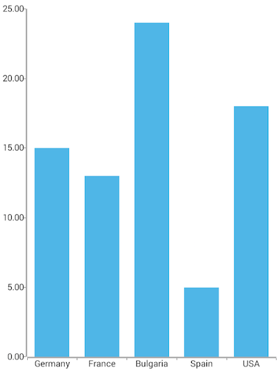

# RadChart Bar Series
Bar Series are categorical type of series that represent the objects from the data source as bars with different length. To use Bar series, you need to initialize a , define a  and  and bind the series to a set of data objects.

## Adjusting Bar Size
By default, the size of a bar is calculated based on the axis plot mode and the count of the categories from the data source. There are cases in which the automatically calculated size does not meet the specific application scenarios. By using the  and  properties you can adjust the size of a single bar within the series. The properties accept values in device independent pixels. These properties define boundaries for the size of a bar.

### Example
The following definition represents the data context that will be used to populate the Bar series with data:

<snippet id='categorical-source'/>

We use an instance of this model to assign it as the `bindingContext` of the page we have put our Bar series on:

<snippet id='binding-context-bar-series'/>

And finally, in the XML definition of the page we put a RadCartesianChart, add a BarSeries instance to it and bind the series to the source of data:

<snippet id='bar-series'/>

> Depending on the required Bar orientation, you can swap the axes' position and assign the Categorical to the *horizontalAxis* property and the Linear to the *verticalAxis* property. This will change the orientation of the bars to vertical.

 

## References
Want to see this scenario in action?
Check our SDK examples repo on GitHub. You will find this and many other practical examples with NativeScript UI.

* [Series Examples](https://github.com/telerik/nativescript-ui-samples/tree/master/chart/app/examples/series)

Related articles you might find useful:

* [**Area Series**]()
* [**Bubble Series**]()
* [**Pie Series**]()
* [**Range-Bar Series**]()
* [**Scatter-Bubble Series**]()
* [**Scatter Series**]()
* [**Spline Series**]()
* [**Line Series**]()
* [**Area Series**]()
* [**Candlestick Series**]()
* [**Ohlc Series**]()