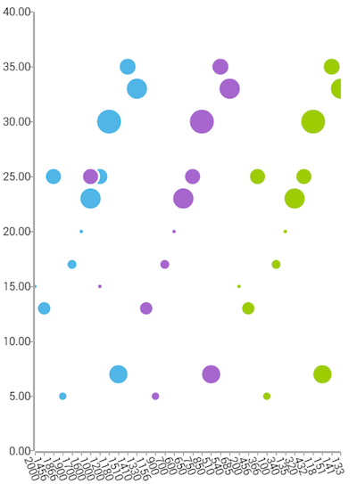
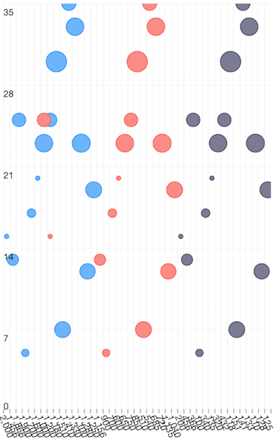

# Bubble series: Overview
Bubble series are  and are used in the context of a ,  and . On top of the requirements for a ,  require an additional setup parameter which should come from the data source that defines the *bubble size*. The value for this parameter is supplied by defining the .

## Customization
On top of the customization options that come from the  context,  expose the  property which can be used to fine-tune the size of the bubbles according to specific application requirements. The way the  property works is by multiplying its value to the radius of calculated for each data-point's bubble.

## Example
The following definition represents the data context that will be used to populate the Bubble series with data:

<snippet id='bubble-data-source'/>

We use an instance of this model to assign it as the *bindingContext* of the page we have put our Bubble series on:

<snippet id='binding-context-bubble-series'/>

And finally, in the XML definition of the page we put a , add a  instance to it and bind the series to the source of data:

<snippet id='bubble-series'/>

 

## References
Want to see this scenario in action?
Check our SDK examples repo on GitHub. You will find this and many other practical examples with NativeScript UI.

* [Series Examples](https://github.com/telerik/nativescript-ui-samples/tree/master/chart/app/examples/series)

Related articles you might find useful:

* [**Area Series**]()
* [**Bar Series**]()
* [**Line Series**]()
* [**Pie Series**]()
* [**Range-Bar Series**]()
* [**Scatter-Bubble Series**]()
* [**Scatter Series**]()
* [**Spline Series**]()
* [**Area Series**]()
* [**Candlestick Series**]()
* [**Ohlc Series**]()
