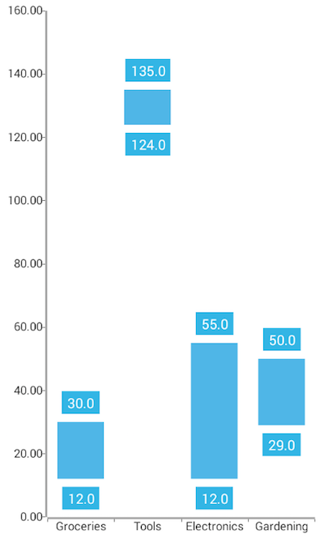
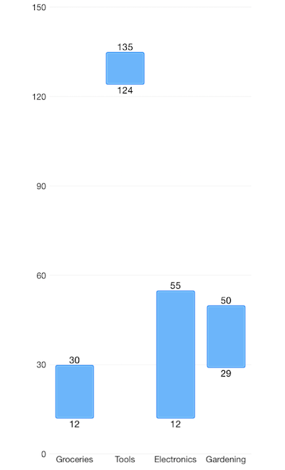

# RadChart RangeBar Series
Range bar series are a special case of bar series where the width of each bar denotes the difference between data point's low and high value. The bars can be displayed either horizontally, or vertically, depending on whether the  is the vertical axis or the horizontal one. When the horizontal axis is categorical, the rectangles are displayed vertically. This means that they have equal width while their height represents the difference between the numerical values of each of the data points. The low value is the rectangle's start point, while the high value is the end point. On the other hand, when the vertical axis is categorical, the rectangles have equal height, while their width represents the difference between the values of the data point.

## Example
Let's use the following model with low & high values:

<snippet id='range-bar-source'/>

We will use an instance of this model to assign it as the *bindingContext* of the page we have put our range bar series on:

<snippet id='binding-context-range-bar'/>

And finally, in the XML definition of the page we put a RadCartesianChart, add a BarSeries instance to it and bind the series to the source of data:

<snippet id='range-bar-series'/>

Depending on the required Bar orientation, you can swap the axes' position and assign the Categorical to the `horizontalAxis` property and the Linear to the `verticalAxis` property. This will change the orientation of the range bars to vertical.

 

## References
Want to see this scenario in action?
Check our SDK examples repo on GitHub. You will find this and many other practical examples with NativeScript UI.

* [Series Examples](https://github.com/telerik/nativescript-ui-samples/tree/master/chart/app/examples/series)

Related articles you might find useful:

* [**Area Series**]()
* [**Bubble Series**]()
* [**Bar Series**]()
* [**Pie Series**]()
* [**Line Series**]()
* [**Scatter-Bubble Series**]()
* [**Scatter Series**]()
* [**Spline Series**]()
* [**Area Series**]()
* [**Candlestick Series**]()
* [**Ohlc Series**]()