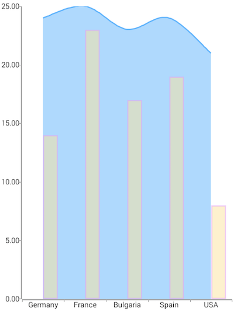
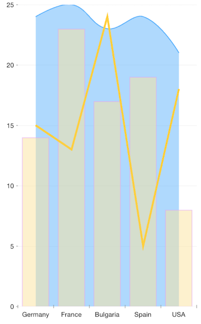

# RadChart Series Styling Palettes
Telerik Chart for NativeScript uses Palettes to enable the customization of series. Depending on the count of series you have defined in your chart, you can add as many palettes as needed and change several visual parameters of the series. A single palette defines an *entries* property which contains  instances. A **`PaletteEntry`** is essentially a property bag which holds the values that are used to style the associated series. The following properties are exposed by a `PaletteEntry` object:

- 
- 
- 

## Example
To better illustrate the usage of Palettes, we will use a scenario with three series of different kind which are customized. Consider the following series:

<snippet id='creating-series'/>

We want to customize all of the series. We will use their `seriesName` to specify which palette is for which series. We want to change the stroke, as well as their fill color. Let's define a new palette for each series in the *palettes* collection of the chart:

<snippet id='creating-palettes'/>

Our palette consists of a single entry that defines values for ,  and . What remains to be done is mapping the palette to the series it is meant to style. This is done by setting the **`seriesName`** property on the series and the palette to the same key. As you can see, the `seriesName` property is set to the Palette and the series to the same value - in that case *Bar*, *Area* and *Line*. You can use any string token here assuming it is the same on the corresponding series and the palette, as it serves as a mapping key between both.

The images below demonstrates the result of applying this palette to the Bar series:

 

If you want to specify additional style for selected state of the series you need to define a new Palette with the corresponding `seriesName` and `seriesState` property set to *Selected* value as it is shown in the following example: 

<snippet id='styling-series-selection'/>

In this example the second palette values will be used when the series or data point is selected. If palette for selected state is not explicitly defined the default colors will be used.

## PaletteMode

By default, the provided palettes (or the default colors) are applied per series, i.e. the first PaletteEntry from a palette will be applied to each of the items in the series. The `paletteMode` property can be used to change the way the palette is applied, i.e. the first PaletteEntry from the palette to be applied to the first item in the series, the second PaletteEntry to the second item, etc. You can choose from the following `paletteMode` values: `Series` or `Item` depending on how you want the palette to be applied. Here's how to change the `paletteMode` for `BarSeries`:

<snippet id='chart-styling-bars'/>

And here's the result on android (on the left) and on iOS (on the right):

 

> Note that the paletteMode is applicable only for series where it visually makes sense. LineSeries, SplineSeries, AreaSeries and SplineAreaSeries (where there are no separate items but only connections between them), the paletteMode is not supported.

## References
Want to see this scenario in action?
Check our SDK examples repo on GitHub. You will find this and many other practical examples with NativeScript UI.

* [Styling Examples](https://github.com/telerik/nativescript-ui-samples/tree/master/chart/app/examples/styling)
