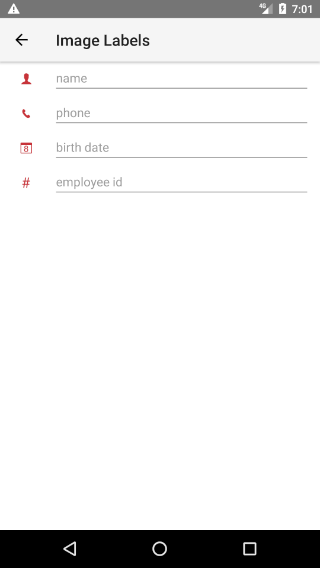
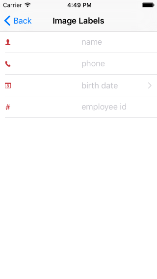

# RadDataForm Image Labels

If you followed the [getting started]( "RadDataForm getting started") section, you now know how to edit an object's properties with `RadDataForm` for NativeScript. This article will explain how to remove the text labels of the editors and add appropriate images instead.

* [Usage](#usage)
* [References](#references)

#### Figure 1: Show image labels instead of text labels in RadDataForm on Android (left) and iOS (right)

 

## Usage

By default  will load a label for each editor with the name of its property with some formatting applied. In order to remove this you can use 's  property and change its value to the empty string. With EntityProperty's , you can specify the resource name with the image that you would like displayed. You can read <a href="https://docs.nativescript.org/ui/images#adding-android-resources" target="_blank">here</a> how to add image resources to a {N} application. Here's an example which also sets a hint text so that the purpose of the field is more obvious for the user:

#### Example 1: Use image resource and hint text instead of displayName for an editor

<snippet id='dataform-image-labels-xml'/>

## References

Want to see this scenario in action?
Check our [SDK Examples](https://github.com/telerik/nativescript-ui-samples) repository on GitHub. You will find this and many other practical examples with NativeScript UI.

* [Image Labels Example](https://github.com/telerik/nativescript-ui-samples/tree/master/dataform/app/examples/image-labels)

Related articles you might find useful:

* [**Styling**]()
* [**Read Only**]()
