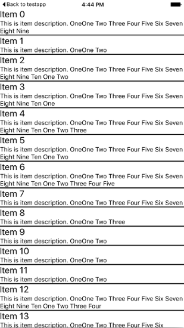

# Item separators: Introduction
This tutorial describes how to add separators between the items in RadListView.

Item separators are lines displayed between the items to better designate the bounds each item occupies within the scrollable list. Item separators are currently not supported as an out-of-the-box feature by RadListView but there is an easy way to implement this behavior which is described in this article.

# Implementing item separators in RadListView

1. Create a page in your NativeScript application and put a  instance bound to a source of data items:

	```XML
    	<Page loaded="onPageLoaded" xmlns:lv="component/listview" xmlns="http://www.nativescript.org/tns.xsd">
        	<lv:RadListView items="{{ dataItems }}" >
            	<lv:RadListView.listViewLayout>
                	<lv:ListViewLinearLayout scrollDirection="Vertical"/>
          	  </lv:RadListView.listViewLayout>
           	 <lv:RadListView.itemTemplate>
           	     <StackLayout orientation="vertical">
           	         <Label fontSize="20" text="{{ itemName }}"/>
           	         <Label fontSize="14" text="{{ itemDescription }}" textWrap="true"/>
           	     </StackLayout>
           	 </lv:RadListView.itemTemplate>
        	</lv:RadListView>
   		</Page>
    ```

    In this particular case, we have a template which has a `StackLayout` as a root panel containing two labels.

2. Add a new `StackLayout` instance in your template and make its height be 2 pixels as shown below:

	```XML
    	<lv:RadListView.itemTemplate>
       		 <StackLayout orientation="vertical">
       		     <Label fontSize="20" text="{{ itemName }}"/>
       		     <Label fontSize="14" text="{{ itemDescription }}" textWrap="true"/>
       		     <StackLayout height="2" backgroundColor="Black"/>
       		 </StackLayout>
    	</lv:RadListView.itemTemplate>
	```

3. Run your application. The result should be as the following screenshot demonstrates:

	

# Conclusion
Item separators are easily implementable in  by adding an element within your template with the corresponding dimensions and color. Separation between items in  can also be implemented by using a margin as demonstrated below:

```XML
    <lv:RadListView.itemTemplate>
        <StackLayout>
            <StackLayout orientation="vertical" marginBottom="2">
                <Label fontSize="20" text="{{ itemName }}"/>
                <Label fontSize="14" text="{{ itemDescription }}" textWrap="true"/>
            </StackLayout>
        </StackLayout>
    </lv:RadListView.itemTemplate>
```
