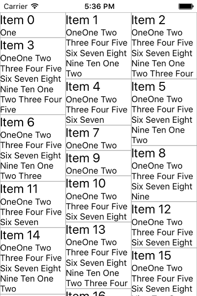
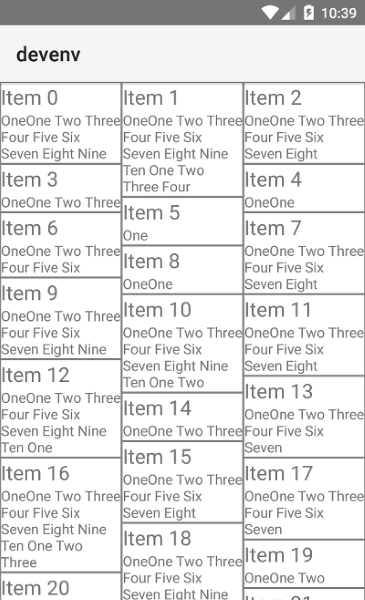

# RadListView Item Layouts
Often there are cases when you need to display your list of items in non-linear layout. For examples, you may want to have a grid of items. For that purpose, RadListView defines three types of item layouts which are fully UI virtualized and optimized for mobile. The following layout types are available:
- **Linear layout** - this is the most common layout used with a RadListView component. Items are ordered horizontally or vertically one at a time.
- **Grid layout** - this is a layout in which items are ordered in columns and rows. Depending on the scrolling orientation (vertical or horizontal), the amount of columns or rows is predefined.
- **Staggered layout** - this is a fancier version of the Grid layout where items are also ordered in rows or columns depending on the scrolling direction whereas no free spaces are preserved between neighboring items in the direction of scrolling.

## Defining a Specific Item Layout
RadListView exposes the `listViewLayout` property which accepts objects inheriting from . Currently the following classes are available:
- 
- 
- 

Each layout object exposes  and  properties which can be used to explicitly define the size of the items. Note that these properties do not always work depending on the layout type currently used, as well as on the platform (Android or iOS).

### Using 'ListViewLinearLayout'
Setting a  is done the following way in XML:

#### __Example 1: Setting ListViewLinearLayout on RadListView:__
<snippet id='listview-item-layouts-linear-xml'/>

> The  and  properties are iOS specific. If not used, items are sized dynamically depending on the data coming from the source.

>  exposes the  property which, when set to `false`, makes the layout use the  and  properties thus making all items have fixed height. This improves the scrolling performance on iOS.

### Using 'ListViewGridLayout'
Setting a  is done the following way in XML:

#### __Example 2: Setting ListViewGridLayout on RadListView:__
<snippet id='listview-item-layouts-grid-xml'/>

Setting the  property to a number will make the  order the items in three columns or rows depending on the scrolling direction. You can also use the  and  properties here for size tuning.

### Using 'ListViewStaggeredLayout'
Setting a `ListViewStaggeredLayout` is done the following way in XML:

#### __Example 3: Setting ListViewStaggeredLayout on RadListView:__
<snippet id='listview-item-layouts-staggered-xml'/>

Defining an explicit item size here is not needed since the essence of a staggered layout is that items are freely measured and positioned according to their desired size as shown on the pictures below. Also note the second Label in the  which enables text-wrapping for its content to allow for arbitrary item size depending on the length of the text. The result is visible on the pictures below:

#### __Figure 1: ListViewStaggeredLayout in action:__
 

## References
Want to see this scenario in action?
Check our SDK examples repo on GitHub. You will find this and many other practical examples with NativeScript UI.

* [Item Layouts Example](https://github.com/telerik/nativescript-ui-samples/tree/master/listview/app/examples/item-layouts)

