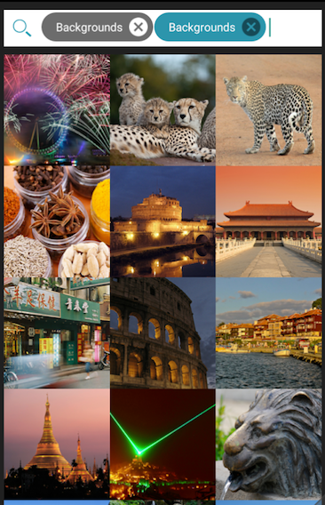

# RadAutoCompleteTextView: Overview

**RadAutoCompleteTextView** can automatically complete user input string by comparing the text being entered to all strings in the associated data source. The control provides means for easy customization and data management.

## Features
### Suggest modes
**RadAutoCompleteTextView** supports three different suggest modes:

- **Suggest** - Suggestions are shown in a drop-down list below the input field.
- **Append** - Only one suggestion is shown as an appended text to the input. 
- **SuggestAppend** - Both **Suggest** and **Append** modes are applied.

### Display modes
**RadAutoCompleteTextView** supports two display modes.

- **Plain** - When **Plain** mode is active, only one item can be selected. The selected item is shown as a plain text in the input field.
- **Tokens** - In **Tokens** mode the **RadAutoCompleteTextView** allows multiple selection of suggestions. The selected items are displayed as tokens.

### Tokens layout modes
**RadAutoCompleteTextView** provides two different layouts of tokens when **Tokens** display mode is used.

- **Wrap** - Tokens are aligned in a grid manner. 
- **Horizontal** - Tokens are aligned horizontally.

### Completion modes
**RadAutoCompleteTextView** has two possible modes on which the filtering function is based.

- **StartsWith** - Shows only suggestions which start with the typed text.
- **Contains** - Shows suggestions which contain the typed text.

#### Figure 1. RadAutoCompleteTextView (iOS/Android)
  

# Angular directives

When using the  with Angular you are going to work with multiple custom angular `RadAutoCompleteTextView` specific directives. In short these directives are used by the angular framework to enable 'linking' between separate HTML tags into one 'complex' element.

Here is a full list of the available custom Angular  directives and components:

## Components
Represent the major elements:

| Selector          | Class (more details)                                  |
|-------------------|-------------------------------------------------------|
| RadAutoCompleteTextView |  |

## Directives
Represent the smaller elements that are visualized in :

| Selector          | Class (more details)                                  |
|-------------------|-------------------------------------------------------|
| SuggestionView |  |

## Inline Directives
Represent the 'link' mechanism of the smaller with the major elements

| Selector          | Class (more details)                                  |
|-------------------|-------------------------------------------------------|
| tkAutoCompleteSuggestionView |  |
| tkSuggestionItemTemplate |  |

