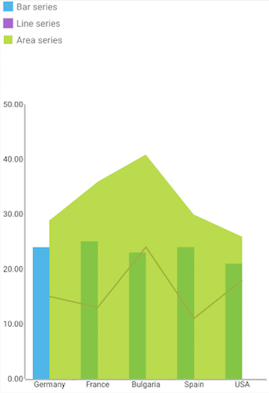
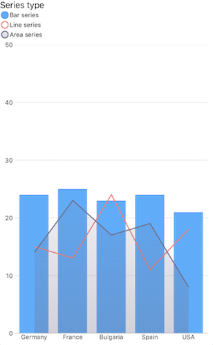

# Chart: Legend
 and  both can display a legend annotating each of the series or datapoints within the chart. In this article you will learn how to show a legend in your chart and how to customize its behavior and appearance.

## Defining a Legend
To define a legend in your chart you need to use the :

<snippet id='chart-legend-angular-definition'/>

The  property expects an instance of the  class which exposes several properties that can be used to customize the size, position and offset of the legend:

-  - used to define the position of the legend. Possible values for this property are defined by the  enum
-  - used to define a horizontal offset for the legend. This offset is calculated considering the currently set 
-  - used to define a vertical offset for the legend. This offset is calculated considering the currently set 
-  - used to define the point relative to which the offsets are calculated. Possible values for this property are defined by the  enum
-  - used to define a title for the legend
-  - used to define the text color of the legend title
-  - used to define the text size of the legend title
-  - determines whether Series or DataPoints in the Chart are automatically selected upon tapping on an item in the Legend

Here's a full example of a chart with a legend set on it:

<snippet id='legend-example-angular'/>

The following images demonstrate how this setup looks like in a running application:

 

## References
Want to see this scenario in action?
Check our Angular SDK examples repo on GitHub. You will find this and many other practical examples with NativeScript UI.

* [Legend Examples](https://github.com/telerik/nativescript-ui-samples-angular/tree/master/chart/app/examples/legend)
