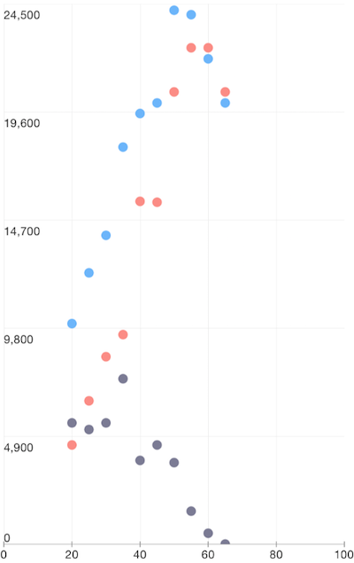

# Scatter series: Overview
Scatter series are used in the context of a  and two  instances. Besides the setup requirements that come from ,  require an additional  and  parameters instead of  and .

## Example
Just like with all angular 'pages' let's start with the `Component` in which we will place our  instance. We create a basic angular `Component` that contains a collection of objects provided by an custom service, which will be used by the chart to provide intuitive data visualization.

The service is a simple 'mock' of an backend call that will return an array of objects:

<snippet id='chart-angular-data-service'/>

Inside that service we have a single function which returns an array:

<snippet id='chart-angular-range-bar-source'/>

<snippet id='chart-angular-product'/>

All that is left is to declare the template of the angular component in which we:

- Declare a 
- Declare two  between the  open and close tags
- After that set the **`tkCartesianHorizontalAxis`** and **`tkCartesianVerticalAxis`** directive to the axes
- Finally declare a  instance to it, bind the  to the source of data and set the **`tkCartesianSeries`** directive

<snippet id='chart-angular-scatter-series-component'/>
<snippet id='chart-angular-scatter-series'/>

 
