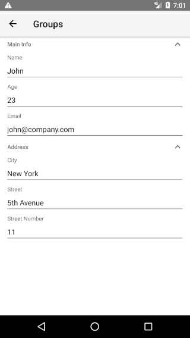
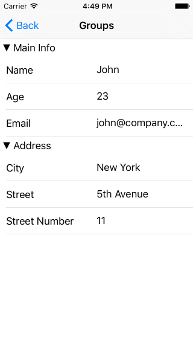

# RadDataForm Groups

If you followed the [getting started]( "RadDataForm getting started") section, you now know how to edit an object's properties with `RadDataForm` for NativeScript. If your source object contains a lot of properties, it may be useful to show them in groups and optionally allow these groups to be collapsed. This article explains how.

* [Add Groups with HTML](#add-groups-with-html)
* [Groups Adjustments](#groups-adjustments)
* [Events](#events)
* [Add Groups with JSON](#add-groups-with-json)
* [References](#references)

#### Figure 1: Show the editors in groups in RadDataForm on Android (left) and iOS (right)

 

## Add groups with HTML

Adding groups to `RadDataForm` and specifying which property belongs to each group is done very intuitively with the HTML. Instead of adding each `TKEntityProperty` to `RadDataForm` directly with the `tkDataFormProperty` directive, we add groups to `RadDataForm` and the we add each `EntityProperty` to its own group with the `tkPropertyGroupProperties`. The following example demonstrates how.

#### Example 1: Add groups to RadDataForm

<snippet id='angular-dataform-groups-html'/>

## Groups Adjustments

Note the  property of the  in the previous example. This allows you to specify whether the groups can be collapsed by tapping on their header. You can use the  property to control the current state of the group. If you want to hide the header, you can use PropertyGroup's  property. To hide the whole group, you can use PropertyGroup's  property. If you need to make changes to some of the properties of a , you can get it by its name through  method and make your changes:

- First we will need to pass the RadDataForm instance to the Angular `@Component`. We can easily do that via the `@ViewChild` mechanism, the `dataformAngularModule` is the `nativescript-ui-dataform/angular` module:

#### Example 2: Access the RadDataFormComponent

<snippet id='angular-runtime-viewchild-html'/>
<snippet id='angular-runtime-viewchild-code'/>

- This will inject the  into the `myRuntimeDataFormComp` property. In order to access the  element simply use the   property: 

#### Example 3: Adjust group's property through code

<snippet id='angular-dataform-groups-code'/>

## Events

 provides the following group related events:
- **groupUpdate** - fired when the a group is being setup and can be used for customizations of the native groups
- **groupExpanded** and **groupCollapsed** - to notify you when a group is collapsed or expanded, if the group supports collapsing. 

These events provide event arguments which have a property  which you can use to determine the name of the group related with the event and a property , which can be used to get the native group element.

## Add groups with JSON

If you are using [JSON metadata](#adjust-editors-with-json) to setup the `RadDataForm`, you can also apply grouping to the properties. Just add `groupName` to each property inside the `propertyAnnotations` array.

#### Example 4: Sample JSON metadata for RadDataForm

```JSON
{
	"propertyAnnotations":
	[
		{
			"name": "city",
			"index": 3,
			"groupName": "Address",
			"editor": "Picker",
			"valuesProvider": ["New York", "Washington", "Los Angeles"]
		},
		{
			"name": "street",
			"index": 4,
			"groupName": "Address"
		},
		{
			"name": "streetNumber",
			"index": 5,
			"editor": "Number",
			"groupName": "Address"
		},
		{
			"name": "age",
			"index": 1,
			"editor": "Number",
			"groupName": "Main Info"
		},
		{
			"name": "email",
			"index": 2,
			"editor": "Email",
			"groupName": "Main Info"
		},
		{
			"name": "name",
			"index": 0,
			"groupName": "Main Info"
		}
	]
}
```

> Please note that the groups are created this way, are not available for the getGroupByName method.

In order to achieve the same look as the group in the above image, we need to also make the new groups collapsible. This can be done through the native groups that are accessible through the `groupUpdate` event:

```
public onGroupUpdate(args) {
	if (ios) {
		let nativeGroup: TKEntityPropertyGroupView = args.group;
		nativeGroup.collapsible = true;
	} else {
		let nativeGroup: com.telerik.widget.dataform.visualization.ExpandableEditorGroup = args.group;
		nativeGroup.setExpandable(true);
	}
}
```

## References

Want to see these scenarios in action?
Check our [SDK Examples for Angular](https://github.com/telerik/nativescript-ui-samples-angular) repo on GitHub. You will find this and many other practical examples with NativeScript UI.

* [Groups Example](https://github.com/telerik/nativescript-ui-samples-angular/tree/master/dataform/app/examples/groups)
* [Runtime Updates Example](https://github.com/telerik/nativescript-ui-samples-angular/tree/master/dataform/app/examples/runtime-updates)

Related articles you might find useful:

* [**Group Layouts**]()
* [**Styling**]()
