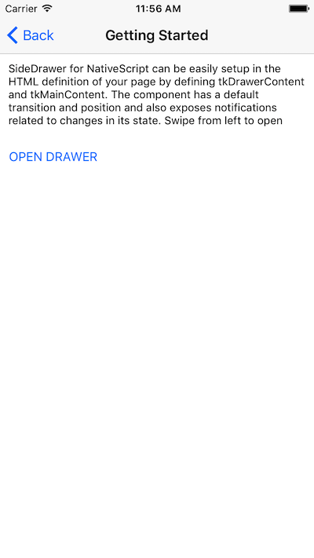
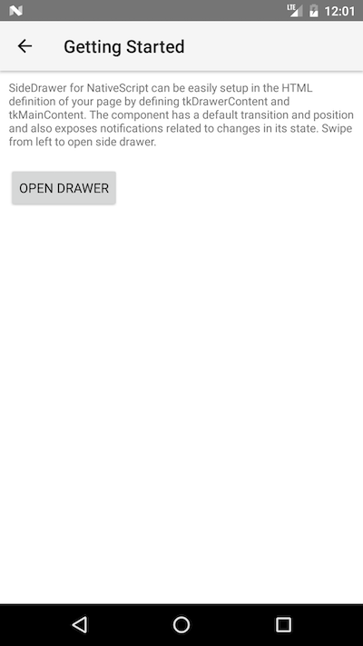
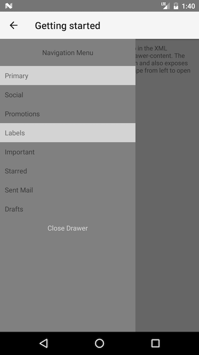

# RadSideDrawer: Getting Started
This article explains how to create a simple RadSideDrawer with Angular.

> By design the `RadSideDrawer` is designed to be placed as a single child in your component's HTML, this excludes the use of a `<ActionBar><ActionBar>` which is not treated as a simple element by NativeScript and can be used with `RadSideDrawer` by placing it in the beginning of the HTML.

## Installation
Run the following command to add the plugin to your application:

```
tns plugin add nativescript-ui-sidedrawer
```

# Initialization
Before proceeding, make sure that the  from the *nativescript-ui-sidedrawer* plugin has been imported in an `ngModule` in your app as explained [here]().

The RadSideDrawer consists of two visual parts:

- `mainContent` - the visual elements displayed in the host view where the drawer is shown.
- `drawerContent` - the visual elements displayed in the side drawer.

Defining `mainContent` and `drawerContent`  with Angular is done with the corresponding directives:

- `TKMainContent` - used with the `tkMainContent` selector
- `TKDrawerContent` - used with the `tkDrawerContent` selector

The following code snippet is a simple template with a basic setup for RadSideDrawer.

<snippet id='angular-sidedrawer-getting-started-html'/>
<snippet id='sidedrawer-getting-started-angular'/>
<snippet id='sidedrawer-getting-started-angular-css'/>

#### Figure 1. RadSideDrawer's 'tkMainContent'
 


#### Figure 2. RadSideDrawer's 'tkDrawerContent'
 


## References
Want to see this scenario in action?
Check our SDK examples repository on GitHub. You will find this and a lot more practical examples with NativeScript UI.

* [Getting Started Example](https://github.com/telerik/nativescript-ui-samples-angular/tree/master/sidedrawer/app/examples/getting-started)

Related articles you might find useful:

* [**Show over navigation bar**]()
* [**Transitions**]()
