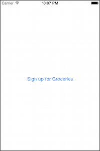
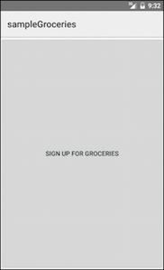
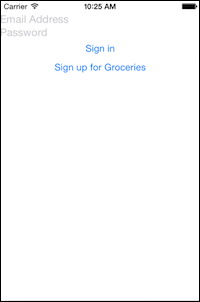
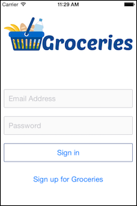
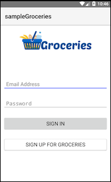

## Building the UI

Before you start coding the Groceries app it's important to understand a NativeScript app's folder structure. It'll help you understand where to place new files, as well as a bit of what's going on with NativeScript under the hood.

Go ahead and open your app's `sample-Groceries` folder in your text editor of choice and let's dig in.

### Directory structure

To keep things simple, let's start by looking at the outer structure of the Groceries app:

```
.
└── sample-Groceries
    ├── app
    │   └── ...
    ├── node_modules
    │   └── tns-core-modules
    ├── package.json
    └── platforms
        ├── android
        └── ios
```

Here's what these various files and folders do:

- **app**: This folder contains all the development resources you need to build your app. You'll be spending most of your time editing the files in here.
- **node_modules**: This folder contains your app's npm module dependencies. All new NativeScript projects start with a single dependency on tns-core-modules.
- **node_modules/tns-core-modules**: This folder contains your app's NativeScript modules, which are a series of NativeScript-provided JavaScript modules you'll use to build your app. Each module contains the platform-specific code needed to implement some feature—the camera, http calls, the file system, and so forth—exposed through a platform-agnostic API (e.g. `camera.takePicture()`). We'll look at some examples momentarily.
- **package.json**: This file contains your app's configuration details, such as your app id, the version of NativeScript you're using, and also which npm modules your app uses. We'll take a closer look at how to use this file when we talk about using npm modules in [chapter 5](#plugins-and-npm-modules).
- **platforms**: This folder contains the platform-specific code NativeScript needs to build native iOS and Android apps. For example in the `android` folder you'll find things like your project's `AndroidManifest.xml` and .apk executable files. Similarly, the `ios` folder contains the Groceries' Xcode project and .ipa executables. Note, users on Windows machines will not have an `ios` folder.

The NativeScript CLI manages the `platforms` folder for you as you develop and run your app; therefore, it's a best practice to treat the `platforms` folder as generated code. The Groceries app includes the `platforms` folder in its [`.gitignore`](https://github.com/NativeScript/sample-Groceries/blob/master/.gitignore) to exclude its files from source control.

Next, let's dig into the `app` folder, as that's where you'll be spending the majority of your time.

```
.
└── sample-Groceries
    ├── app
    │   ├── App_Resources
    │   │   ├── Android
    │   │   └── iOS
    │   ├── shared
    │   │   └── ...
    │   ├── views
    │   │   └── login
    │   │       ├── login.js
    │   │       └── login.xml
    │   ├── app.css
    │   ├── app.js
    │   └── ...
    └── ...
```
Here's what these various files and folders do:

- **App_Resources**: This folder contains platform-specific resources such as icons, splash screens, and configuration files. The NativeScript CLI takes care of injecting these resources into the appropriate places in the `platforms` folder when you execute `tns run`.
- **shared**: This folder, specific to the Groceries app, contains any files you need to share across views in your app. In the Groceries app, you'll find a few view model objects and a `config.js` file used to share configuration variables like API keys.
- **views**: This folder contains the code to build your app's views, each of which will have a subfolder in `views`. Each view is made up of an XML file, a JavaScript file, and an optional CSS file. The groceries app contains three folders for its three views.
- **app.css**: This file contains global styles for your app. We'll dig into app styling in [section 2.3](#css).
- **app.js**: This file sets up your application's starting module and initializes the app.

Let's start with `app/app.js`, as it's the starting point for NativeScript apps. Your `app.js` contains the three lines below: 

``` JavaScript
var applicationModule = require("application");
application.start({ moduleName: "views/login/login" });
```

Here, you're requiring, or importing, the [NativeScript application module]({{site.baseurl}}/ApiReference/application/HOW-TO). Then, you call its `start()` method with the starting screen of your app (the login screen), which lives in your app's `views/login` folder.

> **TIP**: JavaScript modules in NativeScript follow the [CommonJS specification](http://wiki.commonjs.org/wiki/CommonJS). This means you can use the [`require()` method](http://wiki.commonjs.org/wiki/Modules/1.1#Module_Context) to import modules, as is done above, as well as use the `export` keyword to expose a module's properties and methods, which we'll look at later in this chapter. These are the same constructs Node.js uses for JavaScript modules, so if you know how to use Node.js modules, you already know how to use NativeScript modules.

Now that your app is ready for development, let's add some UI components to make your login screen show more than some basic text.

### Adding UI components

Let's dig into the files used to create your app's UI, which reside in the `app/views` folder. Each folder in `app/views` contains the code for one of the three pages in Groceries: `list`, `login`, and `register`. If you look in the `app/views/login` folder, you'll see three files: `login.css`, `login.js`, and the `login.xml` file we updated in the previous chapter. When you open `login.xml` again you should see the following code:

``` XML
<Page>
    <Label text="hello NativeScript" />
</Page>
```

This page currently contains two UI components: a `<Page>` and a `<Label>`. To make this page look more like a login page, let's add a few additional components, namely two `<TextField>` elements and two `<Button>` elements.

<h4 class="exercise-start">
    <b>Exercise</b>: Add UI components to <code>login.xml</code>
</h4>

Open `app/views/login/login.xml` and replace the existing `<Label>` with the following code:

``` XML
<TextField hint="Email Address" keyboardType="email" autocorrect="false" autocapitalizationType="none" />
<TextField hint="Password" secure="true" />

<Button text="Sign in" />
<Button text="Sign up for Groceries" />
```

<div class="exercise-end"></div>

NativeScript UI components provide attributes to let you configure their behavior and appearance. The code you just added uses the following attributes:

- `<TextField>`
    - `hint`: Shows placeholder text that tells the user what to type.
    - `keyboardType`: The type of keyboard to present to the user for input. `keyboardType="email"` shows a keyboard optimized for entering email addresses. NativeScript currently supports [five types of keyboards]({{site.baseurl}}/ApiReference/ui/enums/KeyboardType/README) for text fields.
    - `autocorrect`: A boolean attribute that determines whether the mobile operating system should autocorrect user input. In the case of email address text fields, the autocorrect behavior is undesirable.
    - `autocapitalizationType`: Determines how the operating system should autocapitalize user input. `autocapitalizationType="none"` turns autocapitalization off altogether. NativeScript supports [four autocapitalization types]({{site.baseurl}}/ApiReference/ui/enums/AutocapitalizationType/README.html) on text fields.
    - `secure`: A boolean attribute that determines whether the TextField's text should be masked, which is commonly done on password fields.
- `<Button>`
    - `text`: Controls the text displayed within the button.

After you [run your app](#development-workflow) with this change, you will see a single `<Button>` component on the screen:




Currently you only see a single button because you need to tell NativeScript how to layout your page’s UI components. Let's look at how to use NativeScript layouts to arrange these components on the screen.

> **TIP**: The NativeScript docs include a [full list of the UI components and attributes]({{site.baseurl}}/ui-with-xml) with which you can build your apps. You can even [build your own, custom UI components]({{site.baseurl}}/ui-with-xml#custom-components).

### Layouts 

NativeScript provides several different layout containers that allow you to place UI components precisely where you want them to appear. 

- The [Absolute Layout]({{site.baseurl}}/ApiReference/ui/layouts/absolute-layout/HOW-TO.html) lets you position elements using explicit x and y coordinates. This is useful when you need to place elements in exact locations, for example showing an activity indicator widget in the top-left corner of your app.
- The [Dock Layout]({{site.baseurl}}/ApiReference/ui/layouts/dock-layout/HOW-TO.html) is useful for placing UI elements at the outer edges of your app. For example, a container docked at the bottom of the screen would be a good location for an ad.
- The [Grid Layout]({{site.baseurl}}/ApiReference/ui/layouts/grid-layout/HOW-TO.html) lets you divide your interface into a series of rows and columns, much like a `<table>` in HTML markup.
- The [Stack Layout]({{site.baseurl}}/ApiReference/ui/layouts/stack-layout/HOW-TO.html) lets you stack child UI components either vertically or horizontally.
- The [Wrap Layout]({{site.baseurl}}/ApiReference/ui/layouts/wrap-layout/HOW-TO.html) lets child UI components flow from one row or column to the next when space is filled.

For your login screen, all you need is a simple `<StackLayout>` to stack the UI components on top of each other. In later sections, you'll use some of the more advanced layouts.

<h4 class="exercise-start">
    <b>Exercise</b>: Add a stack layout to the login screen
</h4>

In `login.xml`, add the `<StackLayout>` component within the `<Page>` component. `login.xml` should look like this:

``` XML
<Page>
    <StackLayout orientation="vertical">

        <TextField hint="Email Address" keyboardType="email" autocorrect="false" autocapitalizationType="none" />
        <TextField hint="Password" secure="true" />

        <Button text="Sign in" />
        <Button text="Sign up for Groceries" />

    </StackLayout>
</Page>
```

<div class="exercise-end"></div>

The stack layout is a UI component, and as such, it has attributes just like the `<TextField>` and `<Button>` components you used in the previous section. Here, the `orientation="vertical"` attribute tells the stack layout to arrange its child components vertically.

After you run your app with this change, you'll see that your login page's UI components stack up:




Although the UI components are in the correct order, they could use some spacing and color to make the app look a bit nicer. To do that let's look at another NativeScript feature: CSS.

> **TIP**:
> * Refer to the NativeScript docs for a [more detailed look at how NativeScript layouts work](/layouts) and the various things you can do to configure them.
> * Check out Jen Looper's article on [demystifying NativeScript layouts](https://www.nativescript.org/blog/demystifying-nativescript-layouts) for a more thorough look at NativeScript layouts in action.

### CSS

NativeScript uses a [subset of CSS](/styling) to change the visual appearance of your app. You can use three mechanisms to add CSS properties to UI components: [application-wide CSS](/styling#application-wide-css) (`app.css`), [page-specific CSS](/styling#page-specific-css), and an [inline `style` attribute](/styling#inline-css).

> **TIP**:
> * Place CSS rules that should apply to all pages in your `app.css`, and CSS rules that apply to a single page in a page-specific CSS file (e.g. `login.css`). 
> * Although inline styles are great for quick testing—e.g. `<Page style="background-color: green;">` you should avoid them in general because the `style` attributes tend to clutter up XML files, especially if you need to apply multiple rules.

Let's start by adding a few application-wide CSS rules.

<h4 class="exercise-start">
    <b>Exercise</b>: Create global styles
</h4>

Paste the following code in the `app.css` file:

``` CSS
Page {
    background-color: white;
    font-size: 17;
}
TextField {
    margin: 10;
    padding: 10;
}
Image {
    margin-top: 20;
    margin-left: 0;
    margin-right: 0;
    margin-bottom: 80;
}
Button {
    margin: 10;
    padding: 10;
}
```

<div class="exercise-end"></div>

If you've done any web development before, the syntax should feel familiar here. You select four UI components (Page, TextField, Image, and Button) by their tag name, and then apply a handful of CSS rules as name/value pairs. NativeScript does not support all CSS properties because it is not possible to replicate some of them in native apps without causing performance issues. A [full list of the CSS properties that are supported](/styling#supported-properties) are listed in the NativeScript docs.

Let's make one more change. Although often you want CSS rules to apply equally to your iOS and Android app, occasionally it makes sense to apply a CSS rule to only one platform. For example, iOS text fields frequently have borders around them, but Android text fields do not. Let's look at how to make platform-specific style changes in NativeScript.

<h4 class="exercise-start">
    <b>Exercise</b>: Add platform-specific CSS
</h4>

Add the following as the first line of your app's `app.css` file:

``` CSS
@import { url('~/platform.css') };
```
> **IMPORTANT**: NativeScript is consistent with browser implementations, in that `@import` statements must precede all other CSS rules in a file.

Next, add a `class="link"` attribute to the sign up button in `login.xml`. The button's markup should look like this:

``` XML
<Button text="Sign up for Groceries" class="link" />
```

<div class="exercise-end"></div>

Let's break down what just happened. First, NativeScript supports CSS's `@import` statement for importing one CSS file into another. So this new line of code imports the CSS rules from `platform.css` into `app.css`. But, you might have noticed that Groceries does not have a file named `platform.css`—only `app/platform.android.css` and `app/platform.ios.css` exist. What's going on here?

<a id="platform-specific-files"></a>When you execute `tns run`, or `tns livesync`, the NativeScript CLI takes your code from the `app` folder and places it in the native projects located in the `platforms/ios` and `platforms/android` folders. Here the naming convention comes in: while moving files, the CLI intelligently selects `.android.*` and `.ios.*` files. To give a specific example, the CLI moves `platform.ios.css` into `platforms/ios` and renames it to `platform.css`; similarly, the CLI moves `platform.android.css` into `platforms/android`, and again renames it to `platform.css`. This convention provides a convenient way to branch your code to handle iOS and Android separately, and it's supported for any type of file in NativeScript—not just CSS files. You'll see a few more examples of this convention later in this guide.

There's one other change here we need to discuss, and that's the `class` attribute you added to this button:

``` XML
<Button text="Sign up for Groceries" class="link" />
```

NativeScript uses the `class` attribute for adding CSS class names to UI components. The class name is used to give the sign up button a slightly different look than the sign in button. You can find the CSS rules associated with this class name in `platform.ios.css` and `platform.android.css`:

``` CSS
/* From platform.android.css */
.link {
    background-color: transparent;
}

/* From platform.ios.css */
.link {
    border-width: 0;
}
```

> **TIP**: NativeScript also supports selecting elements by the `id` attribute. Refer to the docs for [a full list of the supported selectors](/styling#supported-selectors).

With these changes in place, you'll notice that the app looks halfway decent now, and also has a distinctly different look on iOS and Android:


Feel free to take some time to play with the look of this app before moving on. You can try adding some additional CSS class names, or adding some page-specific styles in your `login.css` file. When you're ready, let's move on and add an image to this login screen.

### Images

In NativeScript you use the `<Image>` UI component and its `src` attribute to add images to your pages. The `src` attribute lets you specify your image in three ways. The first (and simplest) way is to point at the URL of an image:

``` XML
<Image src="https://www.nativescript.org/images/default-source/landingpages/logo.png" />
```

The second way is to point at an image that lives within your app's `app` folder. For example if you have an image at `app/images/logo.png`, you can use it with:

``` XML
<Image src="~/images/logo.png" />
```

The third way, and the one Groceries uses, is to use platform-specific image resources. Let's add an image to the login screen and then discuss exactly what's happening.

<h4 class="exercise-start">
    <b>Exercise</b>: Add a logo
</h4>

In `login.xml`, add the `<Image>` below as the first child of the existing `<StackLayout>` tag:

``` XML
<Image src="res://logo" stretch="none" horizontalAlignment="center" />
```

<div class="exercise-end"></div>

The `res://` syntax tells NativeScript to use a platform-specific resource, in this case an image. Platform-specific resources go in your app's `app/App_Resources` folder. If you look there you'll find a few different image files, several of which are named `logo.png`.

Although more complex than putting an image directly in the `app` folder, using platform-specific images gives you more control over image display on different device dimensions. For example iOS lets you provide three different image files for devices with different pixel densities. As such you'll find logos named `logo.png`, `logo@2x.png`, and `logo@3x.png` in your `App_Resources/iOS` folder. For Android you'll find similar image files in `App_Resources/Android/drawable-hdpi` (for "high" dpi, or high dots-per-inch), `App_Resources/Android/drawable-mdpi` (for medium-dpi), and `App_Resources/Android/drawable-ldpi` (for low-dpi).

Once these files are in place the NativeScript framework knows how to pick the correct file; all you have to do is reference the image using `res://` and its base file name—i.e. `res://logo`. Here's what your login screen should look like on iOS and Android:




At this point your UI looks good, but the app still doesn't actually do anything. Let's look at how you can use JavaScript to add some functionality.

> **TIP**: The community-written [NativeScript Image Builder](http://nsimage.brosteins.com/) can help you generate images in the appropriate resolutions for iOS and Android.
