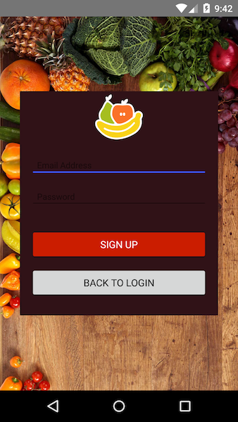
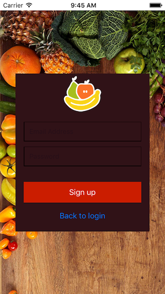
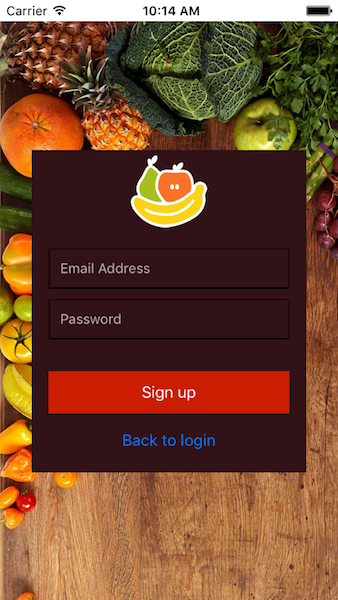
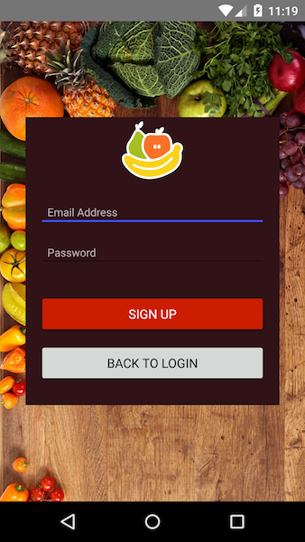
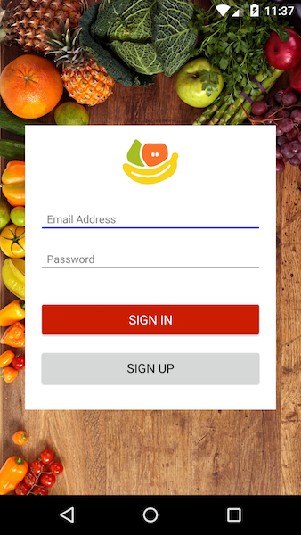
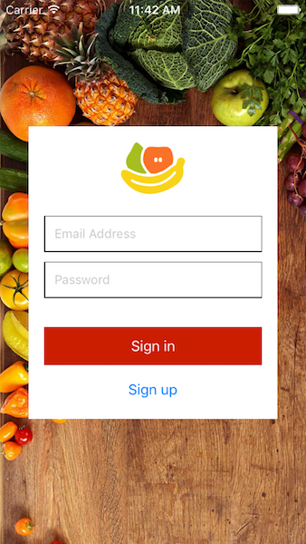

# Chapter 6—Accessing Native APIs

The beauty of NativeScript is that you can write a native iOS or Android app in TypeScript, XML, and CSS without touching Swift, Objective-C, or Java, if you choose. But what if you want to present a different, more platform-specific UI to your users? Or if you want to access an iOS or Android API that NativeScript doesn't expose through a NativeScript module or plugin?

NativeScript gives you the option to dig into native code as needed, and to do so without leaving TypeScript. To show how this works in action, let's tweak a few of the UI elements in your app using native code.

## Table of contents

- [6.1: Accessing iOS APIs](#61-accessing-ios-apis)
- [6.2: Accessing Android APIs](#62-accessing-android-apis)
- [6.3: Customizing the status bar](#63-customizing-the-status-bar)

## 6.1: Accessing iOS APIs

You may recall from earlier chapters that the hint color on your sign up screen could use a little more contrast. Notice the unappealing black on brown color of the text in the images below (if you can see the text at all).




At the time of this writing, NativeScript doesn’t expose a way to style a text field’s hint color through CSS—although [there is an open issue requesting the feature](https://github.com/NativeScript/NativeScript/issues/712)—however, both iOS and Android have ways to accomplish this task, and with NativeScript you have direct access to these native APIs.

Let’s start with iOS. If you run a [generic search for “style iOS text field hint text”](https://www.google.com/#q=style%20ios%20text%20field%20hint%20text), the first result is a [Stack Overflow post](http://stackoverflow.com/questions/1340224/iphone-uitextfield-change-placeholder-text-color) that recommends setting a `UITextField`’s `attributedPlaceholder` property. Let’s look at how to do that.

<h4 class="exercise-start">
    <b>Exercise</b>: Change hint colors on iOS
</h4>

Because there are multiple text fields in Groceries, we’ll write the functionality to change hint colors as a utility that lives in your app’s `utils` folder. Open `app/utils/hint-util.ts` and paste in the following code:

``` TypeScript
import {Color} from "color";
import {TextField} from "ui/text-field";

declare var NSAttributedString: any;
declare var NSDictionary: any;
declare var NSForegroundColorAttributeName: any;

export function setHintColor(args: { view: TextField, color: Color }) {
  let dictionary = new NSDictionary(
    [args.color.ios],
    [NSForegroundColorAttributeName]
  );
  args.view.ios.attributedPlaceholder = NSAttributedString.alloc().initWithStringAttributes(
    args.view.hint, dictionary);
}
```

This code creates a function called `setHintColor()` that accepts a `<TextField>` and `Color`. We’ll talk about the contents of this function momentarily; first let’s look at how to use it.

First, open `app/pages/login/login.html` and switch the two `<TextField>`s to use the following code, which adds a local template variable to each element:

``` XML
<TextField #email hint="Email Address" keyboardType="email" [(ngModel)]="user.email"
  autocorrect="false" autocapitalizationType="none"></TextField>
<TextField #password hint="Password" secure="true" [(ngModel)]="user.password"></TextField>
```

Next, open up `app/pages/login/login.component.ts` and add the following two properties under the existing `@ViewChild("container")` line:

``` TypeScript
@ViewChild("email") email: ElementRef;
@ViewChild("password") password: ElementRef;
```

After that, add the following two imports to the top of the file:

``` TypeScript
import {setHintColor} from "../../utils/hint-util";
import {TextField} from "ui/text-field";
```

Then, add the following function to the file’s `LoginPage` class:

``` TypeScript
setTextFieldColors() {
  let emailTextField = <TextField>this.email.nativeElement;
  let passwordTextField = <TextField>this.password.nativeElement;

  let mainTextColor = new Color(this.isLoggingIn ? "black" : "#C4AFB4");
  emailTextField.color = mainTextColor;
  passwordTextField.color = mainTextColor;

  let hintColor = new Color(this.isLoggingIn ? "#ACA6A7" : "#C4AFB4");
  setHintColor({ view: emailTextField, color: hintColor });
  setHintColor({ view: passwordTextField, color: hintColor });
}
```

Finally, add a call to the new `setTextFieldColors()` in your `LoginPage`’s existing `toggleDisplay()` method—ideally immediately after the existing `this.isLoggingIn = !this.isLoggingIn` line:

``` TypeScript
this.setTextFieldColors();
```

<div class="exercise-end"></div>

After your app refreshes with this change, you should now see a far more readable hint color:



Let’s back up to the contents of the `setHintColor()` function so we can discuss what’s going on here.

``` TypeScript
let dictionary = new NSDictionary(
  [args.color.ios],
  [NSForegroundColorAttributeName]
);
args.view.ios.attributedPlaceholder = NSAttributedString.alloc().initWithStringAttributes(
  args.view.hint, dictionary);
```

By convention, NativeScript controls make their iOS and Android native implementations available via `ios` and `android` properties, respectively. In this code that means that `args.color.ios` resolves to a [`UIColor`](https://developer.apple.com/library/ios/documentation/UIKit/Reference/UIColor_Class/), and `args.view.ios` resolves to a [`UITextField`](https://developer.apple.com/library/ios/documentation/UIKit/Reference/UITextField_Class/). Once you have a reference to these controls you can set native properties on them directly in TypeScript, which this code does with the `UITextField`’s [`attributedPlaceholder` property](https://developer.apple.com/library/ios/documentation/UIKit/Reference/UITextField_Class/#//apple_ref/occ/instp/UITextField/attributedPlaceholder).

The power with NativeScript is you can perform these customizations in TypeScript—there’s no need to jump into Xcode and write Objective-C or Swift. And this doesn’t apply just to attributes. Notice the global `NSDictionary`, `NSAttributedString`, and `NSForegroundColorAttributeName` attributes. In NativeScript, all iOS and Android APIs are globally available to use—again, directly in TypeScript code.

Admittedly, this code can seem a bit arcane if you’ve never written an iOS app before, but the key here is that you’re never limited by the APIs that NativeScript provides out of the box. Most of the time you’ll be able to solve problems using the NativeScript module APIs or NativeScript plugins, but if you hit a scenario your app needs that NativeScript doesn’t provide a module for, you can always hit the native APIs directly.

> **TIP**:
> * NativeScript provides TypeScript declaration files (`.d.ts` files) for all iOS and Android APIs. You can download the files using the links below. One word of warning though: because the declaration files include the entirety of the iOS and Android SDKs, they’re quite large, and can slow TypeScript builds to a crawl because of their sheer size. Nevertheless, the files can be invaluable during development, as they make accessing native APIs a whole lot easier.
>     * [iOS TypeScript declaration file](https://raw.githubusercontent.com/NativeScript/NativeScript/master/tns-core-modules/ios.d.ts)
>     * [Android TypeScript declaration file](https://raw.githubusercontent.com/NativeScript/NativeScript/master/tns-core-modules/android17.d.ts)
> * For detailed information on how NativeScript makes native APIs globally available, read about [“How NativeScript Works”](http://developer.telerik.com/featured/nativescript-works/) on our blog, and [“Accessing Native APIs with JavaScript”](http://docs.nativescript.org/core-concepts/accessing-native-apis-with-javascript) on our documentation.

Let’s move onto how to accomplish this same hint color task on Android.

## 6.2: Accessing Android APIs

Much like with iOS, if you’re not a native Android developer, figuring out how to accomplish a task on Android often starts with a web search. If you run a [search for “style Android text field hint text”](https://www.google.com/#q=style%20android%20text%20field%20hint%20text), you’ll end up on a [Stack Overflow answer](http://stackoverflow.com/questions/6438478/sethinttextcolor-in-edittext) that recommends using a [`android.widget.TextView`’s `setTextHintColor()` method](http://developer.android.com/reference/android/widget/TextView.html#attr_android:textColorHint). Let’s alter our code to do that.

<h4 class="exercise-start">
    <b>Exercise</b>: Change hint colors on Android
</h4>

Open `app/utils/hint-util.ts` and replace the existing contents of the file with the following code:

``` TypeScript
import {Color} from "color";
import {TextField} from "ui/text-field";

declare var NSAttributedString: any;
declare var NSDictionary: any;
declare var NSForegroundColorAttributeName: any;

export function setHintColor(args: { view: TextField, color: Color }) {
  if (args.view.android) {
    args.view.android.setHintTextColor(args.color.android);
  }
  if (args.view.ios) {
    let dictionary = new NSDictionary(
      [args.color.ios],
      [NSForegroundColorAttributeName]
    );
    args.view.ios.attributedPlaceholder = NSAttributedString.alloc().initWithStringAttributes(
      args.view.hint, dictionary);
  }
}
```

<div class="exercise-end"></div>

Remember from the previous section that NativeScript makes native objects available via a `android` property. In this case `args.view.android` refers to a [`TextView`](http://developer.android.com/reference/android/widget/TextView.html), and therefore has the `setHintTextColor()` method that the Stack Overflow post said to call.

One other thing to notice is the if checks that you added around each of the native calls. Your TypeScript code runs across both platforms, and iOS APIs are not available on Android (and vice versa). Testing for the existence of the native object properties is a common way to fork your code in NativeScript to avoid errors. And with this change in place, your hint colors on Android are now far more legible.



Let’s look at one last way we can improve the look of this app with native code.

## 6.3: Customizing the status bar

At the time of this writing, NativeScript does not expose a way to make translucent status bars—aka status bars that you can see through. There is an [open issue requesting this feature](https://github.com/NativeScript/NativeScript/issues/601), but as with anything else when building with NativeScript, you don’t have to be limited by what NativeScript provides out of the box. Let’s look at how you can use that power to make your status bars look a little nicer.

<h4 class="exercise-start">
    <b>Exercise</b>: Making translucent status bars
</h4>

Sometimes accomplishing tasks with native code is simple, as it was with setting hint text on Android, and sometimes it takes a little more work. Because setting a status bar’s appearance is slightly more involved, the code has been prepopulated in `app/utils/status-bar-util.ts`. There are a few comments that link to detailed information on the techniques used, if you’re curious about how it all works.

Because this code changes the appearance of the status bar, we’ll want to call this method as soon as possible, so that the status bar doesn’t awkwardly update after the app has already loaded. Therefore to use this new utility, open `app/main.ts` and replace the contents of the file with the following code, which calls a new `setStatusBarColors()` before the app is bootstrapped.

``` TypeScript
import {nativeScriptBootstrap} from "nativescript-angular/application";
import {AppComponent} from "./app.component";
import {setStatusBarColors} from "./utils/status-bar-util";

setStatusBarColors();
nativeScriptBootstrap(AppComponent);
```

Finally, there are a few last CSS tweaks you to make to account for the now translucent status bars. On iOS a translucent status bar continues to take up space, so you need to adjust the content of the page to sit on top of the status bar’s location. To do so, open `app/platform.ios.css` and paste in the following code:

``` CSS
Page {
  margin-top: -20;
}
```

Next, open `app/pages/list/list.ios.css` and paste in the following code, which moves the add bar down from underneath the list page’s `<ActionBar>`:

``` CSS
.add-bar {
  margin-top: 20;
}
```

On Android a translucent does not take up space, so you need to add a bit of padding to the top of the list page so the status bar and `<ActionBar>` don’t sit on top of one another. To do so, open `app/pages/list/list.android.css` and paste in the following code:

``` CSS
ActionBar {
  padding-top: 10;
}
```

<div class="exercise-end"></div>

And with that, your status bar is now translucent and properly spaced on iOS and Android:




And... that's it! You've created a functional, cross-platform, backend-driven app to manage your grocery list. In the process you've created a unique UI for Android and iOS, leveraged NativeScript plugins and npm modules, learned how to log in and register, managed backend services, created a list, and more. 

Congratulations! Feel free to [share your accomplishment on Twitter](https://twitter.com/intent/tweet?text=I%20just%20built%20an%20iOS%20and%20Android%20app%20using%20@NativeScript%20%F0%9F%8E%89.%20You%20can%20too!%20http://docs.nativescript.org/angular/tutorial/ng-chapter-0%20%23opensource) or [Facebook](https://www.facebook.com/sharer/sharer.php?u=http%3A%2F%2Fdocs.nativescript.org%2Fangular%2Ftutorial%2Fng-chapter-0&p%5B) to impress your friends 😀.

<h4 class="exercise-start">
    <b>Challenge</b>: Add the ability to delete groceries
</h4>

As cool as Groceries is, it’s currently missing one crucial feature for a grocery management app: the ability to delete groceries from the list.

The Groceries backend already supports deleting, but it’s up to you to implement the feature in the app. You do get two hints though. First, below is a function you can use in the `GroceryListService` for performing the necessary HTTP call to delete a grocery:

``` TypeScript
delete(id: string) {
  let headers = new Headers();
  headers.append("Authorization", "Bearer " + Config.token);
  headers.append("Content-Type", "application/json");

  return this._http.delete(
    Config.apiUrl + "Groceries/" + id,
    { headers: headers }
  )
  .map(res => res.json())
  .catch(this.handleErrors);
}
```

Second, here’s an image you can use in your template for users to tap to delete items. One note though: the image is a white “X”, so you’ll have to find a way to create a non-white background in order to see the image.

``` XML
<Image src="res://delete"></Image>
```

If you get stuck, the Groceries app’s [“angular-end” branch](https://github.com/NativeScript/sample-Groceries/tree/angular-end) has a solution you can check.

<div class="exercise-end"></div>

<div class="next-chapter-link-container">
  <a href="ng-chapter-7">Continue to Chapter 7—Next Steps</a>
</div>
