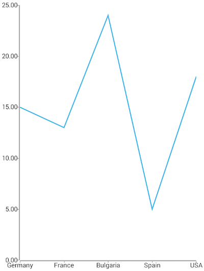
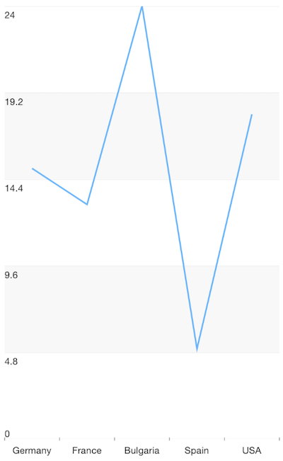

# RadChart Line Series
 are categorical type of series that represent the objects from the data source as dots connected with a line. To use Line series, you need to initialize a , define a  and  and bind the series to a set of data objects.

### Example
Just like with all vue 'pages' let's start with the `Component` in which we will place our  instance.

Before that, we would create a basic JS or TS module that contains a collection of objects, which will be used by the chart to provide intuitive data visualization.

```
import { ObservableArray } from 'tns-core-modules/data/observable-array';

export const getCountriesData = () => {
  return new ObservableArray([
    { Country: 'Germany', Amount: 15, SecondVal: 14, ThirdVal: 24, Impact: 0, Year: 0 },
    { Country: 'France', Amount: 13, SecondVal: 23, ThirdVal: 25, Impact: 0, Year: 0 },
    { Country: 'Bulgaria', Amount: 24, SecondVal: 17, ThirdVal: 23, Impact: 0, Year: 0 },
    { Country: 'Spain', Amount: 11, SecondVal: 19, ThirdVal: 24, Impact: 0, Year: 0 },
    { Country: 'USA', Amount: 18, SecondVal: 8, ThirdVal: 21, Impact: 0, Year: 0 }
  ]);
};
```

All that is left is to declare the template of the vue component in which we:

- Declare a 
- Declare the  and  between the  open and close tags
- After that set the **`tkCartesianHorizontalAxis`** and **`tkCartesianVerticalAxis`** directive to the axes
- Finally declare a  instance to it, bind the  to the source of data and set the **`tkCartesianSeries`** directive

```
import { getCountriesData } from '../../data';

export default {
  template: `
  <Page>
    <RadCartesianChart>
      <LineSeries v-tkCartesianSeries
                  categoryProperty="Country"
                  valueProperty="Amount"
                  :items="items" />
      <CategoricalAxis v-tkCartesianHorizontalAxis />
      <LinearAxis v-tkCartesianVerticalAxis />
    </RadCartesianChart>
  </Page>
  `,
  data () {
    return {
      items: getCountriesData(),
    };
  }
};

```

Here's how your Line chart should look like:

 
