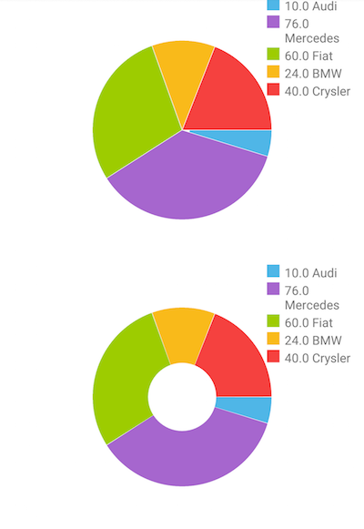

# RadChart Pie Series
Unlike all other series,  do not require axes. They visualize each data point as pie slices with arc size directly proportional to the magnitude of the raw data point's value. Pie slices represent data in one direction contrasting with the other series which represent data in two dimensions.

### Example
Just like with all vue 'pages' let's start with the `Component` in which we will place our  instance.

Before that, we would create a basic JS or TS module that contains a collection of objects, which will be used by the chart to provide intuitive data visualization.

```
import { ObservableArray } from 'tns-core-modules/data/observable-array';

export const getPieData = () => {
  return new ObservableArray([
      { Brand: 'Audi', Amount: 10 },
      { Brand: 'Mercedes', Amount: 76 },
      { Brand: 'Fiat', Amount: 60 },
      { Brand: 'BMW', Amount: 24 },
      { Brand: 'Crysler', Amount: 40 }
  ]);
};
```

All that is left is to declare the template of the vue component in which we:

- Declare two  instances
- Declare a  instance to one of them and  to the other, bind the  of both  instances to the source of data and set the **`tkPieSeries`** directive

```
import * as frameModule from 'tns-core-modules/ui/frame';
import { getPieData } from '../../data';

const description = 'Pie Series';

export default {
  name: 'PieSeriesExample',
  description: description,
  template: `
  <Page>
    <StackLayout>
      <RadPieChart height="300" allowAnimation="true" row="0">
        <PieSeries v-tkPieSeries
                   selectionMode="DataPoint"
                   expandRadius="0.4"
                   outerRadiusFactor="0.7"
                   valueProperty="Amount"
                   legendLabel="Brand"
                   :items="items" />

        <RadLegendView v-tkPieLegend position="Right" title="Brands"
                       offsetOrigin="TopRight" width="110"
                       enableSelection="true"></RadLegendView>
      </RadPieChart>

      <RadPieChart height="300" allowAnimation="true" row="1">
        <DonutSeries v-tkPieSeries selectionMode="DataPoint"
                     outerRadiusFactor="0.9"
                     expandRadius="0.4"
                     outerRadiusFactor="0.7"
                     innerRadiusFactor="0.4"
                     valueProperty="Amount"
                     legendLabel="Brand"
                     :items="items" />

        <RadLegendView v-tkPieLegend position="Right" title="Brands"
                       offsetOrigin="TopRight" width="110"
                       enableSelection="true"></RadLegendView>
      </RadPieChart>
    </StackLayout>
  </Page>
  `,
  data () {
    return {
      items: getPieData(),
    };
  }
};
```

This is how the example looks like:
 
