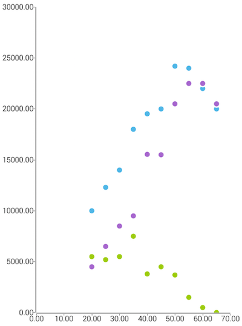

# Scatter series: Overview
Scatter series are used in the context of a  and two  instances. Besides the setup requirements that come from ,  require an additional  and  parameters instead of  and .

## Example
Just like with all vue 'pages' let's start with the `Component` in which we will place our  instance.

Before that, we would create a basic JS or TS module that contains a collection of objects, which will be used by the chart to provide intuitive data visualization.

```
import { ObservableArray } from 'tns-core-modules/data/observable-array';

export const getScatterData = () => {
  return new ObservableArray([
    { Age: 20, Salary: 10000, Spendings: 4500, Savings: 5500, Impact: 1 },
    { Age: 25, Salary: 12300, Spendings: 6500, Savings: 5200, Impact: 7 },
    { Age: 30, Salary: 14000, Spendings: 8500, Savings: 5500, Impact: 10 },
    { Age: 35, Salary: 18000, Spendings: 9500, Savings: 7500, Impact: 6 },
    { Age: 40, Salary: 19520, Spendings: 15540, Savings: 3800, Impact: 4 },
    { Age: 45, Salary: 20000, Spendings: 15500, Savings: 4500, Impact: 2 },
    { Age: 50, Salary: 24200, Spendings: 20500, Savings: 3700, Impact: 11 },
    { Age: 55, Salary: 24000, Spendings: 22500, Savings: 1500, Impact: 8 },
    { Age: 60, Salary: 22000, Spendings: 22500, Savings: 500, Impact: 1 },
    { Age: 65, Salary: 20000, Spendings: 20500, Savings: 10, Impact: 9 }
  ]);
};

```

All that is left is to declare the template of the vue component in which we:

- Declare a 
- Declare two  between the  open and close tags
- After that set the **`tkCartesianHorizontalAxis`** and **`tkCartesianVerticalAxis`** directive to the axes
- Finally declare a  instance to it, bind the  to the source of data and set the **`tkCartesianSeries`** directive

```
import { getScatterData } from '../../data';

export default {
  template: `
  <Page>
    <StackLayout>
      <RadCartesianChart>
        <ScatterSeries v-tkCartesianSeries :items="items" xProperty="Age" yProperty="Salary" bubbleSizeProperty="Impact"></ScatterSeries>
        <ScatterSeries v-tkCartesianSeries :items="items" xProperty="Age" yProperty="Spendings" bubbleSizeProperty="Impact"></ScatterSeries>
        <ScatterSeries v-tkCartesianSeries :items="items" xProperty="Age" yProperty="Savings" bubbleSizeProperty="Impact"></ScatterSeries>

        <LinearAxis v-tkCartesianHorizontalAxis></LinearAxis>
        <LinearAxis v-tkCartesianVerticalAxis></LinearAxis>
      </RadCartesianChart>
    </StackLayout>
  </Page>
  `,
  data () {
    return {
      items: getScatterData(),
    };
  }
};
```

 
